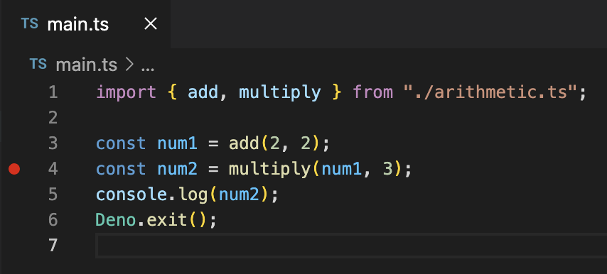
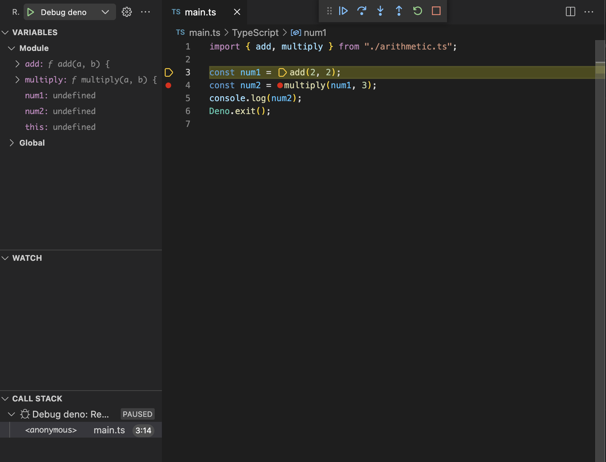

# debug-deno-in-vscode
The purpose of this repo is to demonstrate how to debug deno in vscode. 

## Prerequisite
Install [deno](https://deno.land/).
```bash
brew install deno
```

## Install vscode deno extension
https://marketplace.visualstudio.com/items?itemName=denoland.vscode-deno


## Debugging
Open `main.ts` file and set some break points like image below shown:  


Keep `main.ts` file in focus and press F5 to start debugging.
